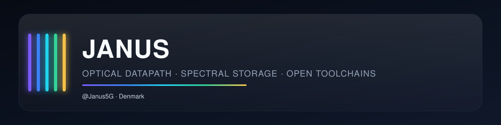

 

**Systems architect and hardware developer.**  
Open work on optical datapath, spectral storage and the compilers that sit on top of them.

---

### Focus

<table>
<tr>
<td width="20%" valign="top">

**PRISME**

</td>
<td>

Five-channel spectral storage in glass. Ten bits per light pulse, UV error checking, zero power at rest.

</td>
</tr>
<tr>
<td valign="top">

**ChromaPlex**

</td>
<td>

Experimental CPL/CPA instruction set, compiler, assembler and crystal-voxel simulator for colour-channel storage.

</td>
</tr>
<tr>
<td valign="top">

**Toolchain**

</td>
<td>

Linux-first editor, ISO workbench, portable binary interchange and a multi-mode coding agent.

</td>
</tr>
<tr>
<td valign="top">

**ChromaLearn**

</td>
<td>

Open AI learning platform for schools. Teacher control, session privacy, school-chosen model.

</td>
</tr>
</table>

---

### Repositories

| | Project | Role |
| :---: | --- | --- |
|  | [PRISME](https://github.com/Janus5G/PRISME) | Spectral storage, error checking, archival glass medium |
|  | [chromaplex-os](https://github.com/Janus5G/chromaplex-os) | Language, compiler, assembler, 3D crystal simulator |
|  | [chromaplex-os-compiler](https://github.com/Janus5G/chromaplex-os-compiler) | Compiler toolchain for ChromaPlex OS |
|  | [Cplex](https://github.com/Janus5G/Cplex) | Rust/Slint desktop editor with CPA assembly and simulator |
|  | [Chromaplex-Coding-Agent](https://github.com/Janus5G/Chromaplex-Coding-Agent) | Multi-mode agent for Linux, Windows, web, embedded, CPL/CPA |
|  | [ChromaLearn](https://github.com/Janus5G/ChromaLearn) | School AI platform with session-private data |
| | [ChromaPress](https://github.com/Janus5G/ChromaPress) | Linux ISO customisation for WSL2 and Debian/Ubuntu |
| | [PRISME-Binary-Extension](https://github.com/Janus5G/PRISME-Binary-Extension) | Portable binary packaging for edge and server systems |
| | [Architecture spec](https://github.com/Janus5G/ChromaPlex-v2.0-Specification-Architecture-Documentation) | Spatial and angular optical computer architecture |

---

### Stack

  

---

Sponsorship supports public compilers, simulators, specs and school tooling.  
It does not sell equity, tokens or exclusive rights to the public work.

**[github.com/sponsors/Janus5G](https://github.com/sponsors/Janus5G)**

